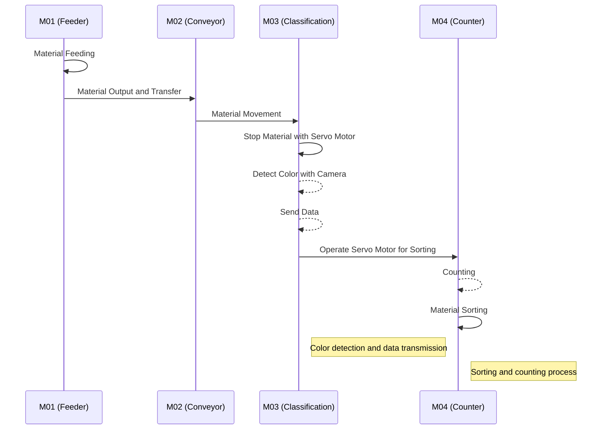

```mermaid
graph TD
    A[" "] -->|**Physical Movement**| B[" "]
    C[" "] -.->|**Information Transmission**| D[" "]

    %% 설명 박스 추가
    E["🔹 **Solid Line (→): Physical material movement**"]:::desc
    F["🔹 **Dashed Line (-.->): Information transmission**"]:::desc

    %% 박스를 스타일링 (노드로 보이지 않게)
    classDef desc fill:#fdf5a0,stroke:#000,stroke-width:1px,font-weight:bold
